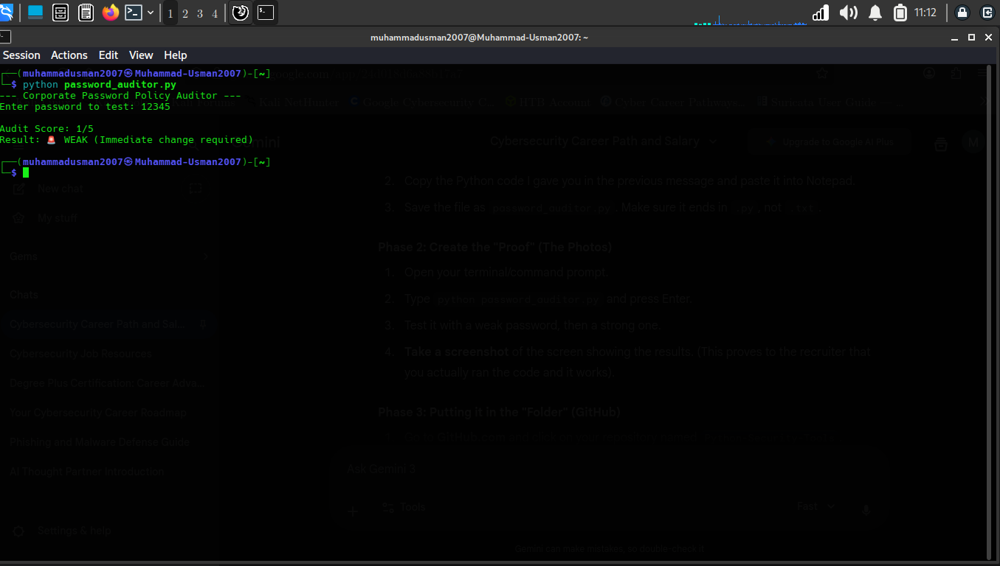
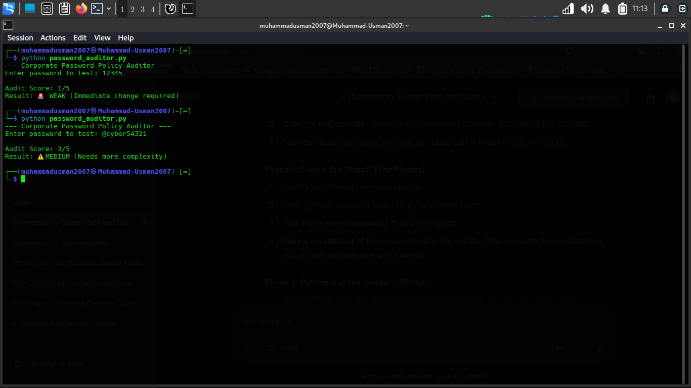
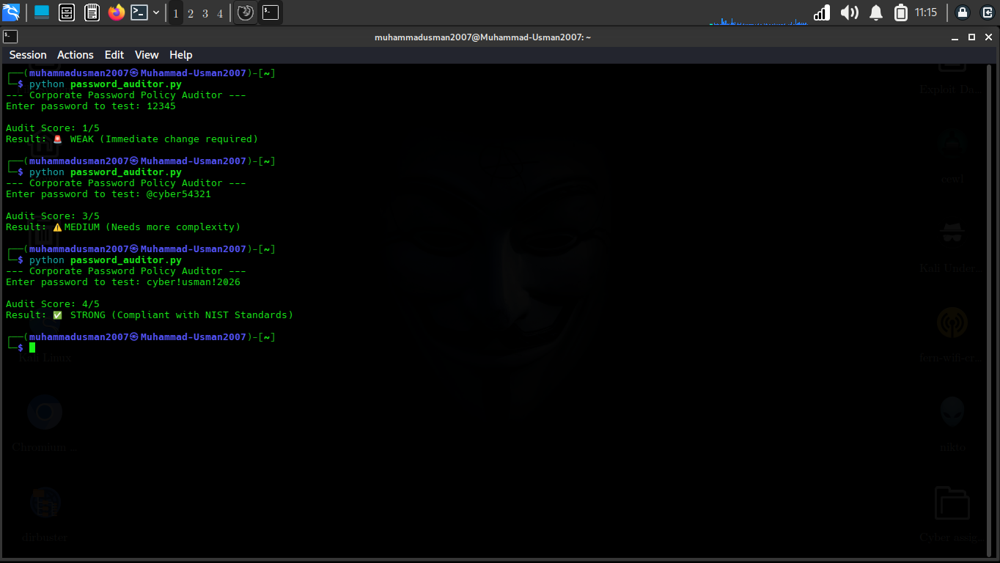

# Python-Security-Tools-
Automated security scripts for policy auditing and threat detection.
# 🐍 Automated Password Strength Auditor

## 🛡️ Project Overview
This Python-based security tool audits password strength based on **NIST 800-63B** complexity requirements. It is designed to simulate a corporate policy check by evaluating entropy, length, and character variety.

## 🚀 Features
* **Length Validation:** Flags passwords under 12 characters as high risk.
* **Complexity Analysis:** Detects Integers, Uppercase, and Special Characters.
* **Risk Scoring:** Provides real-time feedback (Weak, Medium, Strong).

## 📸 Technical Proof (Lab Results)
Below are the results from testing the auditor in a Linux environment:

| Risk Level | Test Case | Status |
| :--- | :--- | :--- |
| **🚨 WEAK** | `12345` | Failed: No complexity, too short. |
| **⚠️ MEDIUM** | `@cyber54321` | Warning: Missing uppercase characters. |
| **✅ STRONG** | `cyber!usman!2026` | Passed: Meets all NIST security standards. |

### Gallery
| Weak Test | Medium Test | Strong Test |
| :--- | :--- | :--- |
|  |  |  |

## 🛠️ Installation & Usage
1. Clone the repository:
   ```bash
   git clone https://github.com/Muhammad-Usman-cyber/Python-Security-Tools-.git
